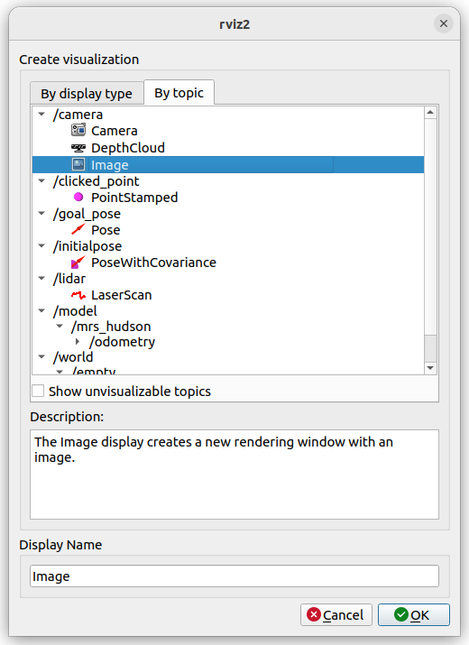
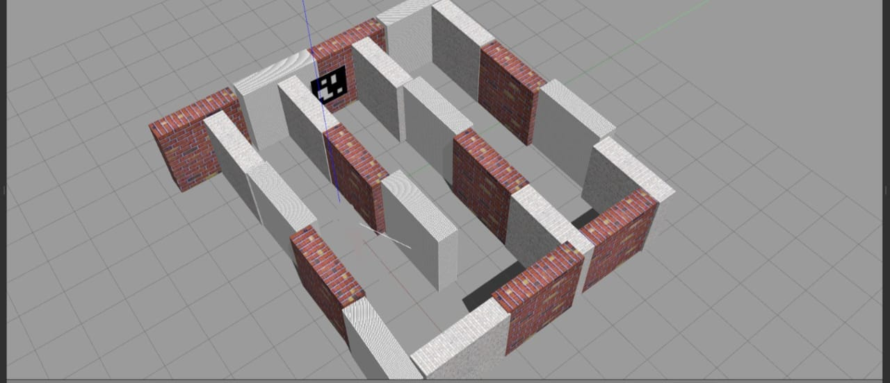
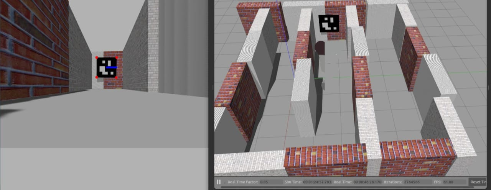

# Episode 2 - The Sign of ArUcos


So till now you have learnt how to control our bot and guide it through the maze using your keyboard. But when we are thinking about challenging Moriarty, we can't take any chances! We have to ensure that the bot is able to navigate it's own way through the maze using some clues present at each nodes of the maze. Holmes has deduced the nature of the clues that would be present. According to him, they would be of the form of markers known as ArUco markers. We need to train our bot to identify and process these. But before that, what exactly are this 'ArUco markers'? Let's find out...


## ArUco Markers
ArUco marker is a grid of black and white squares, typically a 5x5 grid, which looks something like this:


ArUco markers are used to for camera pose estimation, or calibration of the bot. In an ArUco marker, black box represents the number 0 and white box represents the number 1. So going by this, let us breakdown the above marker into grid. Also note that ArUco markers have a black border(padding) of 1 unit around them to make their detection easier, so that is neglected below.


ArUco markers use parity to figure out the orientation of the marker. You may read more about parity bits [here](https://en.wikipedia.org/wiki/Parity_bit) and how it is used in ArUco markers [here](https://pdfcoffee.com/aruco-tutorial-pdf-free.html). [This](https://ria.ua.pt/bitstream/10773/23890/1/artigo.pdf) is how it is able to detect its orientation with the help of parity.

It's fine if you don't understand what parity bits are, as that part is taken care by the computer.


Alright, so now we understand what ArUco markers are, we need to find a way so that they are read by the bot through a camera fitted on it. This can be achieved through OpenCV.

## OpenCV


OpenCV (Open-Source Computer Vision Library) is an open-source library that includes several hundreds of computer vision algorithms. It helps us in performing various operations on images very easily.

In our task we will be mainly using ArUco, an OpenCV based library for detecting the markers and navigating through the maze. Nevertheless, some basic knowledge of OpenCV might be very useful for some of your future projects in Gazebo and Rviz.

### Installation and Setup

#### Installing OpenCV </br>
  
 Execute 
 ```bash
 pip --version
 ```
 Ensure that pip is configured with python3.xx . If not you may have to use (```pip3 --version```).
If it shwos 'ImportError: No module named pip' or similar error, you need to install pip by executing
 ```bash
 pip install pip
 ```
Execute either
```bash
pip install opencv-contrib-python
#or
pip install opencv-python
```
Use ```pip3``` in the above commands, if python3 is configured with one of them.

Type ```python3``` in Terminal to start Python interactive session and type following codes there.
```bash
import cv2 as cv
print(cv.__version__)
```
If you're encountering an issue with the cv2 (OpenCV) library and its interaction with the numpy library. then execute following 

```bash
pip install --upgrade numpy
```

If the results are printed out without any errors, congratulations !!! You have installed OpenCV-Python successfully.

You may Install OpenCV from source. (Lengthy process)

Please refer to this [link](https://docs.opencv.org/4.5.0/d2/de6/tutorial_py_setup_in_ubuntu.html). This installation can take some time so have patience.

#### Setting up VS code

Download and extract the [images_for_cv2](misc/images_for_cv2.zip).

Launch VSC and in the explorer’s tab open the newly created folder (opencv_tutorials) and create a .py file to write your practice code.
Open the Extensions tab on the left side of your screen. Search and install the python extension.

Congrats! Now we are all set. For this workshop we will be using standard functionality of OpenCV for ArUco markers. To learn basic commands and uses of OpenCV and how it is used in image processing, go [here](https://github.com/erciitb/Image-processing).

## Libraries for ArUco Markers 

Let us see how can we use OpenCV to detect ArUcos. By detecting, here our objective is to detect the position of the corners of the marker and ID of the marker(this is different from the data bits number, read on to find out). We will use the python library - ArUcos. In the header of your python script, add the following libraries:

```python
import numpy as np
import math
import cv2
import cv2.aruco as aruco
```
`aruco` library has predefined dictionaries of markers, which it uses to detect the given markers. We have to create an instance of these dictionaries before we proceed. It is done using:

```python
aruco_dict = aruco.Dictionary_get(aruco.DICT_5x5_250)
```
_If due to some reason, you are getting an error in the above line of code, you can replace it by:_
```python
aruco_dict = aruco.Dictionary_get(getattr(aruco, f'DICT_{5}X{5}_{250}'))
```
Moving on, this is an example of a dictionary of 250 ArUco markers of size 5x5. 

Let us say the image we have got from the camera is stored in the variable `img`. (We will discuss how to get the image from camera in ROS later) \
Also remember that it is okay to have more than one ArUco markers in an image.

Ok, so now lets convert this image into grayscale image and store it into another variable `gray`.
```python
gray = cv2.cvtColor(img, cv2.COLOR_BGR2GRAY)
```
Next we create an instance of a class, which includes all the options that can be customized during the marker detection process:
```python
Parameters = aruco.DetectorParameters_create()
```
And finally, we unpack parameters of the marker through:

```python
corners, ids, _ = aruco.detectMarkers(gray, aruco_dict, parameters = Parameters)
```
Note that we have used " _ " above because there is a third parameter which is returned above and we aren't interested in it.

So let us see what are the arguments:
- gray : Grayscale image of the sample to be detected.
- aruco_dict : The dictionary of which the ArUco marker is a part of.
- Parameters : This is the object returned by the aruco.DetectorParameters_create()

What this returns is:
- ids : This is a list, which contains the ArUco id according to the dictionary; if there are N markers in the image, then size of the list is N.
- corners : This is a numpy array of the 2D coordinates of the corners of the markers. For each marker, the four corners are returned in their _**original**_ order, i.e. clockwise starting from top right(This info will come handy later, remember it). If there are N markers in the image, then the size of the array(i.e. _corners_) is Nx4.

## cv_bridge

Now that we are familiar with the basics of OpenCV, ArUco and ROS2, we can finally talk about integrating these two and performing various operations on images such as image detection.</br>

Unfortunately, in ROS2, the format of the images being processed (ROS2 image Message) is quite different than that used in OpenCV (cv::Mat). This is where the library  cv_bridge comes to the rescue! </br>
We create a publisher-subscriber model to import and export images out of ROS into OpenCV and back into ROS. 


### Let us start with a simple example.
Suppose, we are getting Image data on ```/camera`` topic. 
Here is a node that listens to a ROS image message topic, converts the images into an cv::Mat, displays the image using OpenCV. 

```python
import rclpy # Python library for ROS 2
from rclpy.node import Node # Handles the creation of nodes
from sensor_msgs.msg import Image # Image is the message type
from cv_bridge import CvBridge # Package to convert between ROS and OpenCV Images
import cv2 # OpenCV library
 
class ImageSubscriber(Node):
  """
  Create an ImageSubscriber class, which is a subclass of the Node class.
  """
  def __init__(self):
    """
    Class constructor to set up the node
    """
    # Initiate the Node class's constructor and give it a name
    super().__init__('image_subscriber')
      
    # Create the subscriber. This subscriber will receive an Image
    # from the camera topic. The queue size is 10 messages.
    self.subscription = self.create_subscription(
      Image, 
      'camera', 
      self.listener_callback, 
      10)
    self.subscription # prevent unused variable warning
      
    # Used to convert between ROS and OpenCV images
    self.br = CvBridge()
   
  def listener_callback(self, data):
    """
    Callback function.
    """
    # Display the message on the console
    self.get_logger().info('Receiving video frame')
 
    # Convert ROS Image message to OpenCV image
    current_frame = self.br.imgmsg_to_cv2(data)
    
    # Display image
    cv2.imshow("camera", current_frame)
    
    cv2.waitKey(1)
  
def main(args=None):
  
  # Initialize the rclpy library
  rclpy.init(args=args)
  
  # Create the node
  image_subscriber = ImageSubscriber()
  
  # Spin the node so the callback function is called.
  rclpy.spin(image_subscriber)
  
  # Destroy the node explicitly
  # (optional - otherwise it will be done automatically
  # when the garbage collector destroys the node object)
  image_subscriber.destroy_node()
  
  # Shutdown the ROS client library for Python
  rclpy.shutdown()
  
if __name__ == '__main__':
  main()
```


## Proceeding to detect ArUco..

Pull the latest version of ```mrs_hudson``` repo by,

```bash
cd ~/erc_ws/src
mkdir mrs_hudson
cd mrs_hudson
git init
git pull https://github.com/erciitb/mrs_hudson.git
```
Note if you have mrs_hudson folder from before which you ```git cloned``` then delete and do by ```git pull``` as you can directly pull newer version of mrs_hudson.

And make sure to change the path of meshes in the new urdf and sdf files.

(PS: Use a simple find and replace, eg 

find = ```home/saurabh42/erc_ws/src/mrs_hudson/meshes```

replace = ```home/shiwani418/erc_ws/src/mrs_hudson/meshes```

Do a replace all in both the URDF and SDF file.
)

Then run ```colcon build``` in the workspace.

Now, let's run it.
```bash
ros2 launch mrs_hudson maze_aruco.launch.py
```

You can see ArUco marker in front of the bot.
Let's execute ``` ros2 topic list ``` in another tab.
```bash
/camera
/clicked_point
/cmd_vel
/goal_pose
/initialpose
/lidar
/model/mrs_hudson/odometry
/parameter_events
/rosout
/tf
/tf_static
/world/empty/model/mrs_hudson/joint_state
```
Camera Sensor is publishing data of ```sensor_msgs/msg/Image``` msg type to ```/camera``` topic. Let's visualize this data throgh **Rviz**.

Run ```rviz2``` in Terminal. Click on Add button, Under tab **By topic** add ```camera/Image``` topic. You can see data published on this topic.  



Now, we will subscribe ```/camera``` topic to convert ROS Image data to OpenCV Image data using **cv_bridge**.

Execute the following command in another tab.
```bash
ros2 run mrs_hudson detect_marker
```

Have a look at the detect_marker.py file

```python
from sensor_msgs.msg import Image
from cv_bridge import CvBridge
import cv2
import rclpy
from rclpy.node import Node
import cv2.aruco as aruco
import numpy as np

class ArUcoDetector(Node):
    def __init__(self):
        super().__init__('detect_marker')
        self.bridge = CvBridge()
        self.subscription = self.create_subscription(
            Image,
            '/camera',
            self.callback,
            10
        )
        self.subscription  # prevent unused variable warning

    def detect_ArUco(self, img):
        Detected_ArUco_markers = {}
        gray = cv2.cvtColor(img, cv2.COLOR_BGR2GRAY)
        aruco_dict = aruco.Dictionary_get(aruco.DICT_5X5_250)
        parameters = aruco.DetectorParameters_create()

        corners, ids, _ = aruco.detectMarkers(gray, aruco_dict, parameters=parameters)

        i = 0
        try:
            for id in ids:
                for id_Number in id:
                    Detected_ArUco_markers[id_Number] = corners[i][0]
        except TypeError:
            self.get_logger().info("No aruco in front of me")

        i += 1
        return Detected_ArUco_markers

    def mark_ArUco(self, img, Detected_ArUco_markers):
        ids = Detected_ArUco_markers.keys()
        centre_aruco = {}
        top_centre = {}

        try:
            for id in ids:
                corners = Detected_ArUco_markers[id]
                for i in range(0, 4):
                    cv2.circle(img, (int(corners[i][0]), int(corners[i][1])), 5, (0, 0, 255), -1)
                centre_aruco[id] = (corners[0] + corners[1] + corners[2] + corners[3]) / 4
                top_centre[id] = (corners[0] + corners[1]) / 2
                cv2.line(img, (int(centre_aruco[id][0]), int(centre_aruco[id][1])),
                         (int(top_centre[id][0]), int(top_centre[id][1])), (255, 0, 0), 5)

        except TypeError:
            self.get_logger().info("No aruco in front of me")

        return img

    def callback(self, msg):
        try:
            cv_image = self.bridge.imgmsg_to_cv2(msg, "bgr8")
        except CvBridgeError as e:
            self.get_logger().error("CvBridge Error: {0}".format(e))

        Detected_ArUco_markers = self.detect_ArUco(cv_image)
        img = self.mark_ArUco(cv_image, Detected_ArUco_markers)
        cv2.imshow("Image Window", img)
        cv2.waitKey(1)

def main(args=None):
    rclpy.init(args=args)
    try:
        node = ArUcoDetector()
        rclpy.spin(node)
    except KeyboardInterrupt:
        pass
    finally:
        node.destroy_node()
        rclpy.shutdown()

if __name__ == '__main__':
    main()	
```
Run ```ros2 run mrs_hudson mrs_hudson_teleop``` in another window, and try to move the bot.

Now, we have seen ArUco detection,

# Let's Solve mAzE

At this stage, you have enough knowledge to escape from the maze created by Moriarty.

Go through **maze_aruco.launch.py** file in launch folder.

```python
from launch import LaunchDescription
from launch_ros.actions import Node
import os
from launch.actions import DeclareLaunchArgument
from launch.actions import IncludeLaunchDescription
from launch.conditions import IfCondition
from launch.launch_description_sources import PythonLaunchDescriptionSource
from launch.substitutions import LaunchConfiguration, PathJoinSubstitution
from ament_index_python.packages import get_package_share_directory

def generate_launch_description():
	
	pkg_project = get_package_share_directory('mrs_hudson')
	pkg_ros_gz_sim = get_package_share_directory('ros_gz_sim')
	sdf_file = os.path.join(pkg_project, 'models', 'mrs_hudson.urdf')
	with open(sdf_file, 'r') as infp:
 		robot_desc = infp.read()			
 		
	robot_state_publisher = Node(
  	 package='robot_state_publisher',
   	 executable='robot_state_publisher',
   	 name='robot_state_publisher',
   	 output='both',
   	 parameters=[
   	     {'use_sim_time': True},
   	     {'robot_description': robot_desc},
   	 ]
	) 			

	gz_sim = IncludeLaunchDescription(
        PythonLaunchDescriptionSource(
            os.path.join(pkg_ros_gz_sim, 'launch', 'gz_sim.launch.py')),
        launch_arguments={'gz_args': os.path.join(pkg_project, 'worlds', 'mrs_hudson.sdf')}.items(),
    	)
	
	bridge = Node(
        package='ros_gz_bridge',
        executable='parameter_bridge',
        arguments=['/cmd_vel@geometry_msgs/msg/Twist@gz.msgs.Twist',
                   '/model/mrs_hudson/odometry@nav_msgs/msg/Odometry@gz.msgs.Odometry',
                   '/world/empty/model/mrs_hudson/joint_state@sensor_msgs/msg/JointState@ignition.msgs.Model',
                   '/lidar@sensor_msgs/msg/LaserScan@gz.msgs.LaserScan',
                   '/camera@sensor_msgs/msg/Image@gz.msgs.Image',
                   ],
        output='screen'
        )
        
	rviz = Node(
	package='rviz2',
	executable='rviz2',
	arguments=['-d', os.path.join(pkg_project, 'config', 'mrs_hudson.rviz')],
	)	        

	return LaunchDescription([
		robot_state_publisher,
		rviz,	            
		gz_sim,
		bridge
		])
```
Execute following command 
```bash
ros2 launch mrs_hudson maze_aruco.launch.py
```
Upon execution, the following screen should be visible.



Cool !

How will you come out of this maze, which is surrounded by walls from all the sides ?

Well, it's Moriarty's maze.

There is a trick - Bot can go through some of the walls present in the maze. But, how will bot find those walls ? 

ArUco says hi!! 

ArUco will guide you along the way to solve the maze. 



The **Blue line** in ArUco marker in "Image Window" is indicating that magic wall 

Execute ```ros2 run mrs_hudson detect_marker.py```. Open new terminal and execute ```ros2 run mrs_hudson mrs_hudson_teleop``` to control bot.

If you are curious about how these walls are created, don't worry. We will go deeper into these things in coming week.

Now, go ahead and solve the maze. :)

### That's the end of Week 2! Cheers!


