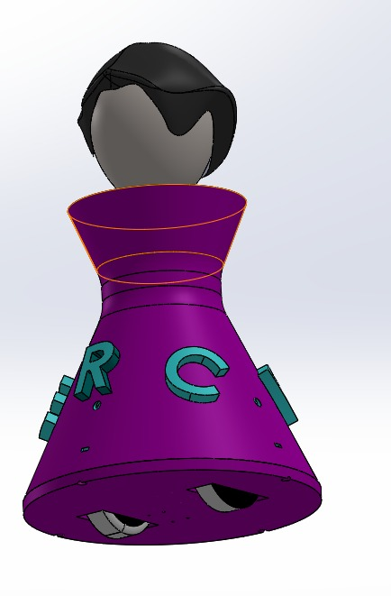
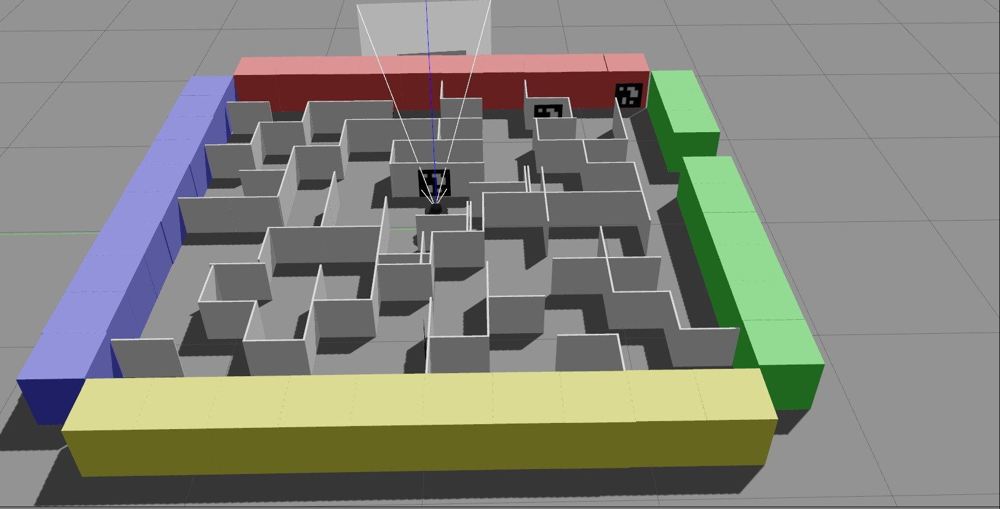

# A fROSty-Winter-2023

Hi! Welcome to a **fROSty Winter**.

Detective Sherlock Holmes's arch-nemesis Moriarty has escaped into the virtual world of simulations. He needs tech-savvy detectives with the knowledge of ROS2, OpenCV, and Gazebo to catch Moriarty and end it once and for all.

## Objectives of this Workshop:
1. The objective of this workshop is to give you the basic tools and knowledge to be able to understand and create any basic ROS related project. You will be able to move robots, read their sensor data, make the robots perform intelligent tasks, see visual representations of complex data such as laser scans and debug errors in the programs.
2. This will allow you to understand the packages that others have done. So you can take ROS code made by others and understand what is happening and how to modify it for your own purposes
3. This can serve as an introduction to be able to understand the ROS documentation of complex ROS packages for object recognition, text to speech, navigation and all the other areas where ROS developed code.

You're going to learn a lot, and it's gonna be a hell a lot of fun.

## Weekly learnings
The workshop is packed with challenging activities solved using very useful tools. The following is what you are going to learn throughout the month and what will the final goal.
### Week 0 
Learn basic tools and units of ROS, how these interact with each other and how to make one of your own. In the assignment for this week you will have made your own ROS setup comprising of 3 components talking to each other and working on the data provided by others. This is the basis of ROS, where different units (sensors, algorithms, simulators etc. called nodes) interact with each other (on topics called ROS topics) and each of those perform a function.

### Week 1
This week is the one with introduction to most of the new stuff. You get to simulate your bots in virtual reality!! Basics of Gazebo (a simulation software) and how it interfaces with ROS are taught here. But wait, which bot do you simulate? Our own custom mrs_hudson. We are going to write code that allows us to control it; or perhaps a few of them together with a just a few clicks. Not just this, you can also see and feel what these bots can using RViz (a visualization software). This is where your virtual reality links with algorithms that can be applied to bots in the real world as well.

### Week 2
Time to put your sherlock brains to the test. I am sure all of you have used QR codes. Its time for SherlockBot to use them too. This week you are going to teach your bots how to _see_. Not just that, you can now process this data with the help of OpenCV. This is a library used to implement image processing. Simpler QR codes called ArUcos markers will be interfaced in your ROS setups. And get excited for the assignment of this week, so for it is the coolest of all. You have to solve a maze with certain penetrable walls by reading the ArUcos markers available. Now this is giving reallll Sherlock vibes!!

### Week 3
The final week has come, for you to show all that you have mastered. Not just this, you also learn to write high quality code files to make your creations more of a universal standard. The assignment for this week is where you make a bot autonomous so that it can solve a much more complex maze. The story ends here and Sherlock awaits his next adventure.

.... to be continued

Head on to [Episode 0](/Episode%200%20-%20A%20Study%20in%20ROS2.md) and start the investigation! 

Let's begin !!
